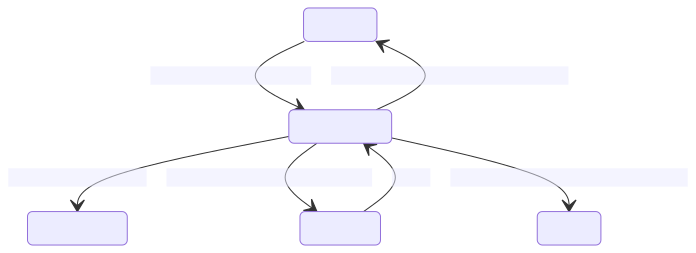

# Auto-indexing

<aside class="experimental">

Experimental This feature is experimental and might change or be removed in the future. We've released it as an experimental feature to provide a preview of functionality we're working on.

<b>We're very much looking for input and feedback on this feature.</b> You can either <a href="https://about.sourcegraph.com/contact">contact us directly</a>, <a href="https://github.com/sourcegraph/sourcegraph">file an issue</a>, or <a href="https://twitter.com/sourcegraph">tweet at us</a>.

</aside>

With Sourcegraph deployments supporting [executors](../../admin/executors.md), your repository contents can be automatically analyzed to produce a code graph index file. Once [auto-indexing is enabled](../how-to/enable_auto_indexing.md) and [auto-indexing policies are configured](../how-to/configure_auto_indexing.md), repositories will be periodically cloned into an executor sandbox, analyzed, and the resulting index file will be uploaded back to the Sourcegraph instance.

## Lifecycle of an indexing job

Index jobs are run asynchronously from a queue. Each index job has an attached _state_ that can change over time as work associated with that job is performed. The following diagram shows transition paths from one possible state of an index job to another.

The general happy-path for an index job is: `QUEUED`, `PROCESSING`, then `COMPLETED`.

Index jobs may fail to complete due to the job configuration not aligning with the repository contents or due to transient errors related to the network (for example). An index job will enter the `FAILED` state on the former type of error and the `ERRORED` state on the later. Errored index jobs may be retried a number of times before moving into the `FAILED` state.

At any point, an index job record may be deleted (usually due to explicit deletion by the user).

## Lifecycle of an indexing job (via UI)

Users can see precise code navigation index jobs for a particular, repository by navigating to the code graph page in the target repository's index page.

Administrators of a Sourcegraph instance can see a global view of code graph index jobs across all repositories from the _Site Admin_ page.

The detail page of an index job will show its current state as well as detailed logs about its execution up to the current point in time.

The stdout and stderr of each command run during pre-indexing and indexing steps are viewable as the index job is processed. This information is valuable when troubleshooting a [custom index configuration](../references/auto_indexing_configuration.md) for your repository.

Once the index job completes, a code graph data file has been uploaded to the Sourcegraph instance. The associated upload record is available from the detail view of an index job.

