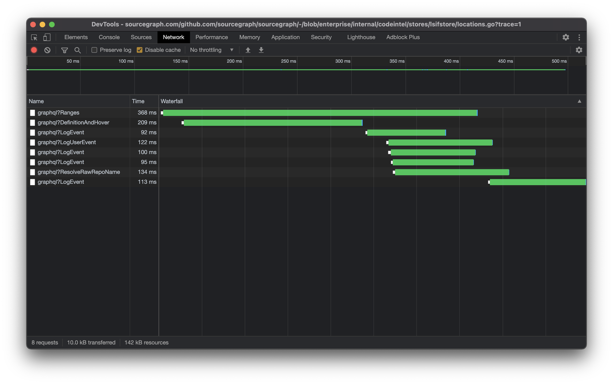
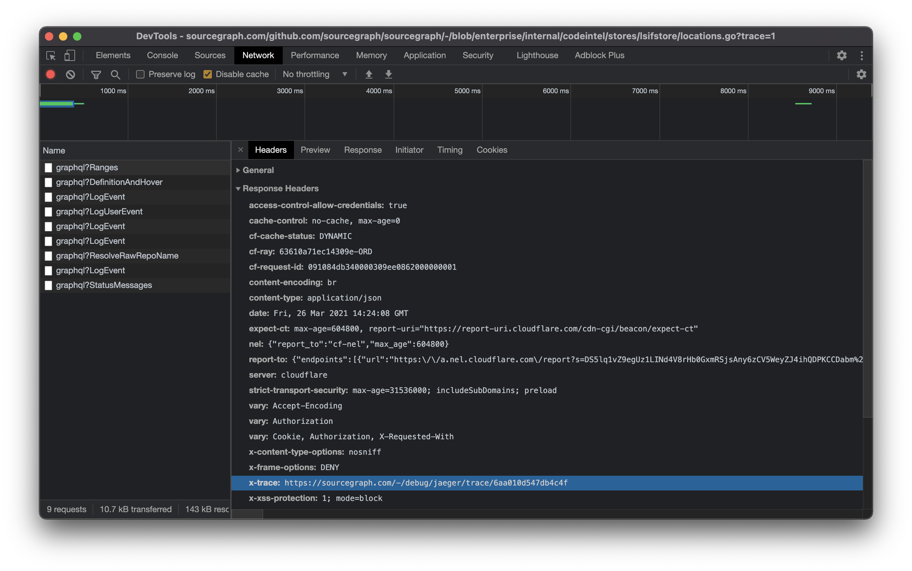

# Code navigation troubleshooting guide

This guide gives specific instructions for troubleshooting code navigation in your Sourcegraph instance.

## When are issues related to code-intelligence?


Issues are related to Sourcegraph code navigation when the [indexer](./indexers.md) is one that we build and maintain.

A customer issue should **definitely** be routed to code navigation if any of the following are true.

- Precise code navigation queries are slow
- Precise code navigation queries yield unexpected results

A customer issue should **possibly** be routed to code navigation if any of the following are true.

- Search-based code navigation queries are slow
- Search-based code navigation queries yield unexpected results

A customer issue should **not** be routed to code navigation if any of the following are true.

- The indexer is listed in [LSIF.dev](https://lsif.dev/) and _it is not_ one that we maintain. Instead, flag the indexers status and maintainer of the relevant indexer with the customer, and suggest they reach out directly

## Gathering evidence

Before bringing a code navigation issue to the engineering team, the site-admin or customer engineer should gather the following details. Not all of these details will be necessary for all classes of errors.

#### Sourcegraph instance details

The following details should always be supplied.

- The Sourcegraph instance version
- The Sourcegraph instance deployment type (e.g. server, pure-docker, docker-compose, k8s)
- The memory, cpu, and disk resources allocated to the following containers:
  - frontend
  - precise-code-intel-worker
  - codeintel-db
  - minio

If the customer is running a custom patch or an insiders version, we need the docker image tags and SHAs of the following containers:

- frontend
- precise-code-intel-worker

#### Sourcegraph CLI details

The following details should be supplied if there is an issue with _uploading_ LSIF indexes to their instance.

- The Sourcegraph CLI version

```bash
$ src version
Current version: 3.26.0
Recommended Version: 3.26.1
```

#### Extension details

The following details should be supplied if the user administrates their own [extension registry](../../admin/extensions/index.md).

- The manifest of relevant language extensions (e.g. _sourcegraph/go_, _sourcegraph/typescript_) viewable from the `/extensions/{extension name}/-/manifest` page on their instance. As an example, see the [Go language extension manifest](https://sourcegraph.com/extensions/sourcegraph/go/-/manifest) on Sourcegraph.com (generally, the value of `gitHead` is enough).

#### Settings

The following user settings should be supplied if there is an issue with _displaying_ code navigation results. Only these settings should be necessary, but additional settings can be supplied after private settings such as passwords or secret keys have been removed.

- codeIntel.lsif
- codeIntel.traceExtension
- codeIntel.disableRangeQueries
- basicCodeIntel.includeForks
- basicCodeIntel.includeArchives
- basicCodeIntel.indexOnly
- basicCodeIntel.unindexedSearchTimeout

You can get your effective user settings (site-config + user settings override) with the following Sourcegraph CLI command.

```bash
$ src api -query 'query ViewerSettings { viewerSettings { final } }'
```

If you have [jq](https://stedolan.github.io/jq/) installed, you can unwrap the data more easily.

```bash
src api -query 'query ViewerSettings { viewerSettings { final } }' | jq -r '.data.viewerSettings.final' | jq
```

#### Traces

[Jaeger](https://docs.sourcegraph.com/admin/observability/tracing) traces should be supplied if there is a noticeable performance issue in receiving code navigation results in the SPA. Depending on the type of user operation that is slow, we will need traces for different request types.

| Send traces for _____ requests... | when latency _____ is high...                                       |
| --------------------------------- | ------------------------------------------------------------------- |
| `?DefinitionAndHover`, `?Ranges`  | between hovering over an identifier and receiving hover text        |
| `?References`                     | between querying references and receiving the first result          |
| `?Ranges`                         | between hovering over an identifier and getting document highlights |

To gather a trace from the SPA, open your browser's developer tools, open the network tab, then add `?trace=1` to the URL and refresh the page. Note that if the URL contains a query fragment (such as `#L24:27`), the query string must go **before** the leading hash.

Hovering over identifiers in the source file should fire off requests to the API. Find a request matching the target type (given in the table above). If there are multiple matching requests, prefer the ones with higher latencies. The `x-trace` header should have a URL value that takes you a detailed view of that specific request. This trace is exportable from the Jaeger UI.



